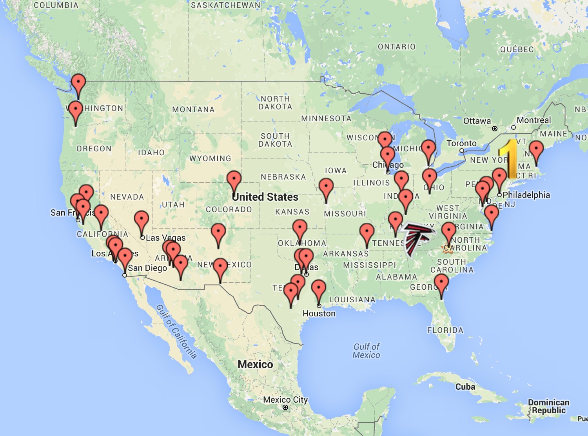

#WebApp created with Google Maps API and Angular.js 
### Took U.S. population data from wikipedia.org, converted to JSON which is saved in the cities.js file
### Bound this data and Google API'sto View and Controller using Angular $scope application object.
### Based off this data - created markdowns, search for directions/hospitals/firestations, and search directions from origin of Atlanta functionality.
###Google's API's are user friendly and contain a heap of pre-written code

